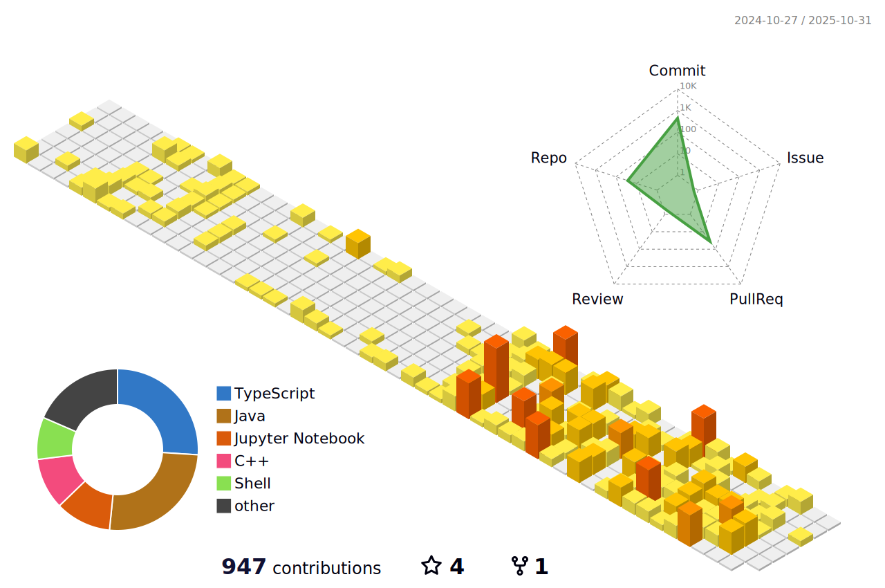

<!-- RAINBOW LINE TOP -->

  <h2>
    
    Explore my work by visiting my 
    <a href="https://harshanalf.netlify.app/" target="_blank">3D portfolio</a>
  </h2>

  

  

	
    

<!--horizontal divider(gradiant)-->

 

  
  
  
  
  

<h1 align="center">Hi , I'm Harshana Lakshara</h1>

 

  <em>
    Hello, I am Harshana Fernando, a <b>third year</b> undergraduate from the <a href="https://uom.lk/"> <b>University Of Moratuwa</b>, Sri Lanka ("Wisdom is all wealth")</a>. 
    I am a <b>passionate self-learner</b>  and a <b>Software Engineer</b>&nbsp;&nbsp;,  
    who is <b>obsessed</b> with <b>Web Engineering</b> and <b>Combative Coding</b>, always striving to uncover hidden patterns in data and solve challenging problems.
</em>
<!--horizontal divider(gradiant)-->

<h1> <picture></picture> About me
</h1>

<picture> </picture>

    

        <ul style="list-style-type: none; padding: 0;">
            <li>✔ Call me: He/His 😊</li>
            <li>✔ Currently learning: Generative AI, NLP, AI, algorithms, DevOps, and web development 🥰</li>
            <li>✔ Seeking collaboration: Open Source projects</li>
            <li>✔ Feel free to ask me anything; if I'm alive, you'll get a response within seconds 😉</li>
            <li>✔ Competitive coder, undergraduate at UOM</li>
            <li>✔ Hobbies: coding, comics, manga, manhwa, anime, TV series, films</li>
        </ul>
    

<!--horizontal divider(gradiant)-->

<!-- STACK -->

  <h1><b>Skills</b></h1>

  <!-- Languages -->
   
  <h3>Languages</h3>
  

  

    
    
    
    
    
    
    
    
    
  

  <!-- Frameworks & Libraries -->
   
  <h3>Frameworks & Libraries</h3>
  

  

    
    
    
    
    
    
    
    
    
    
  

  <!-- Databases -->
   
  <h3>Databases</h3>
  

  

    
    
    
    
  

  <!-- Tools & Platforms -->
   
  <h3>Tools & Platforms</h3>
  

  

    
    
    
    
    
    
    
    
    
    
    
    
    
    
  

  <!-- Testing -->
   
  <h3>Testing</h3>
  

  

    
    
    
    
    
  

<!--horizontal divider(gradiant)-->

<!-- STATS -->

  <h1><b>Statistics</b></h1>

## Streak Stats

  
  
  <!-- Horizontal divider (gradient) -->
  

## GitHub Stats

  <!-- Horizontal divider (gradient) -->
  

## Top languages

  <!-- Horizontal divider (gradient) -->
  

## Trophy

  

 

 

   

<!--horizontal divider(gradiant)-->

## 3D Contrib

<!--horizontal divider(gradiant)-->

## 🐍 A Snake Eating my Contributions Graph

   
  
  
   

<!--horizontal divider(gradiant)-->

        
        
Loading...

 

  

  
  <b><i>"A dream can make a man feel alive. It gives him something to live for. But when that dream is over, it is no longer a dream. It becomes a burden." - Griffith</i></b>
  

<!--horizontal divider(gradiant)-->

## Thanks for Visiting!

  

Credit: [Harshana Lakshara Fernando](https://github.com/UchihaIthachi)

Last edited on: 19/06/2024

<!-- RAINBOW LINE TOP -->

## References

For more details about my references and tools, check out [REFERENCE.md](https://github.com/UchihaIthachi/UchihaIthachi/blob/main/REFERENCE.md).

<!-- RAINBOW LINE TOP -->

